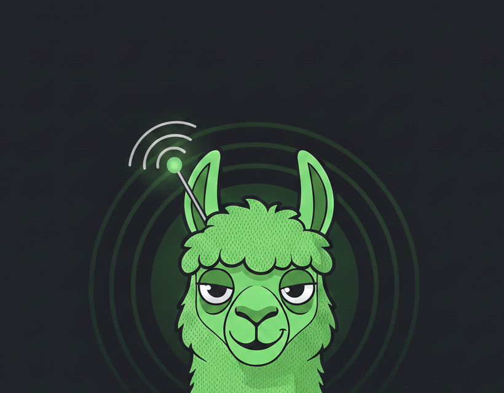

<p align="center">
  
</p>

<h1 align="center">LoRaLlama</h1>

<p align="center">
  <strong>Connect an LLM to a Meshtastic LoRa mesh radio network</strong><br>
  Auto-responds to mesh messages with AI-generated replies. Real-time web dashboard included.
</p>

<p align="center">
  
  
  
  
</p>

---

## What is this?

LoRaLlama bridges an LLM to a [Meshtastic](https://meshtastic.org/) mesh radio network. Plug in a Meshtastic radio via BLE, serial, or TCP, and every incoming mesh message gets an AI-generated response sent back over the air. A web dashboard lets you monitor the network in real time.

**Key features:**
- Automatic LLM responses to mesh messages (Ollama, Anthropic Claude, or OpenAI)
- Real-time web dashboard with live map, node tracking, and message history
- Pond ripple animations on the map when nodes send messages
- Follow mode to auto-track active nodes on the map
- Content filtering and rate limiting
- Weather and web search tools the LLM can use in responses
- Per-user conversation memory and facts
- Interactive CLI with full control over the bridge
- Setup wizard for first-time configuration
- SQLite database stores all packets, telemetry, positions, and messages

## Quick Start

### 1. Install dependencies

```bash
pip install meshtastic bleak requests flask flask-socketio
```

For your LLM provider:
```bash
pip install anthropic   # for Claude
pip install openai      # for OpenAI
# Ollama needs no pip package — just install and run it
```

### 2. Start the bridge

```bash
# Launch both bridge + dashboard together
python launch.py

# Or run them separately:
python llm_mesh_bridge.py     # bridge (BLE + Ollama defaults)
python dashboard.py           # dashboard at http://localhost:5000
```

The first run launches a **setup wizard** that walks you through connection type, LLM provider, and system prompt.

### 3. Open the dashboard

Navigate to **http://localhost:5000** to see the live map, messages, node list, and network stats.

## Connection Options

```bash
# Bluetooth (default — auto-detects nearby devices)
python llm_mesh_bridge.py

# Specific BLE address
python llm_mesh_bridge.py --ble AA:BB:CC:DD:EE:FF

# Serial / USB
python llm_mesh_bridge.py --serial COM4          # Windows
python llm_mesh_bridge.py --serial /dev/ttyUSB0  # Linux

# TCP (remote node)
python llm_mesh_bridge.py --tcp 192.168.1.100

# Scan for BLE devices
python llm_mesh_bridge.py --scan

# Skip setup wizard
python llm_mesh_bridge.py --no-setup

# Listen only (no auto-responses)
python llm_mesh_bridge.py --no-auto
```

## LLM Providers

| Provider | Setup | Notes |
|----------|-------|-------|
| **Ollama** (default) | `ollama serve` then `ollama pull llama3.2` | Free, runs locally, no API key needed |
| **Anthropic** | `export ANTHROPIC_API_KEY=your-key` | Claude models |
| **OpenAI** | `export OPENAI_API_KEY=your-key` | GPT models |
| **None** | `--llm none` | Listen-only, no responses |

## CLI Commands

Once the bridge is running, you have an interactive terminal:

| Command | Description |
|---------|-------------|
| `/send <msg>` | Send a message to the mesh |
| `/status` | Show connection status |
| `/nodes` | List known mesh nodes |
| `/auto on/off` | Enable/disable auto-respond |
| `/db` or `/stats` | Show database statistics |
| `/packets [type] [n]` | Show recent packets |
| `/user <name>` | Show detailed user profile |
| `/memory` | Show memory stats |
| `/remember <fact>` | Add global context the LLM will always know |
| `/weather` | Get current weather |
| `/search <query>` | Manual web search |
| `/quit` | Exit the bridge |

## Dashboard

The web dashboard runs on port 5000 and includes:

- **Live map** with node markers, short names, and status colors based on last-heard time
- **Pond ripple animations** — concentric rings pulse from nodes when they send messages
- **Follow mode** — auto-pans the map to active messaging nodes, restores your view after 30s
- **Route visualization** between nodes
- **Message panel** with channel filtering and DM badges
- **Node list** with search, sort, and detailed stats
- **Network tab** with telemetry, positions, traceroutes, and neighbor info
- **Stats panel** with time-range filters
- **Weather widget**

## Architecture

```
┌─────────────────┐         ┌──────────────┐
│  Meshtastic     │  BLE/   │              │
│  Radio          │◄─Serial─┤  Bridge      │
│  (LoRa mesh)    │  /TCP   │  (llm_mesh_  │
└─────────────────┘         │   bridge.py) │
                            │              │
                            │  ┌─────────┐ │     ┌───────────┐
                            │  │ LLM     │ │     │ Ollama /  │
                            │  │ Handler ├─┼────►│ Claude /  │
                            │  └─────────┘ │     │ OpenAI    │
                            │              │     └───────────┘
                            │  ┌─────────┐ │
                            │  │ SQLite  │ │
                            │  │ mesh_   ├─┼──┐
                            │  │ data.db │ │  │
                            │  └─────────┘ │  │  ┌────────────┐
                            └──────────────┘  │  │ Dashboard  │
                                              └──┤ (Flask)    │
                                                 │ :5000      │
                                                 └────────────┘
```

Both processes share a single SQLite database (WAL mode) — the bridge writes packets and messages, the dashboard reads them for display.

## Configuration

Edit the constants at the top of `llm_mesh_bridge.py`:

```python
LLM_PROVIDER = "ollama"          # "ollama", "anthropic", "openai", "none"
OLLAMA_MODEL = "llama3.2"        # any Ollama model
WEATHER_LAT = 30.2672            # your latitude
WEATHER_LON = -97.7431           # your longitude
LOCATION = "Austin, Texas"       # your location name
TIMEZONE = "America/Chicago"     # your timezone
CONTENT_FILTER_ENABLED = True    # profanity/PII filtering
RATE_LIMIT_MESSAGES = 10         # max messages per user per minute
```

For the dashboard, optionally set:
```bash
export FLASK_SECRET_KEY=your-secret-here
```

## Technical Notes

- **Meshtastic packet limit is 237 bytes** — responses are truncated to 200 bytes for safety. Emojis cost 4 bytes each.
- **Channels 0-7** — channel 0 is the default primary (LongFast).
- The bridge includes **prompt injection protection** to prevent mesh users from manipulating the LLM's system prompt.
- **Content filtering** catches profanity, hate speech, scam attempts, and PII before the LLM processes or responds.
- The database auto-migrates schema changes between versions.

## Requirements

- Python 3.12+
- A [Meshtastic](https://meshtastic.org/) radio device (any hardware supported by the Python API)
- Bluetooth, USB, or network access to the radio
- [Ollama](https://ollama.ai/) installed locally (for default provider), or an API key for Anthropic/OpenAI

## License

MIT
